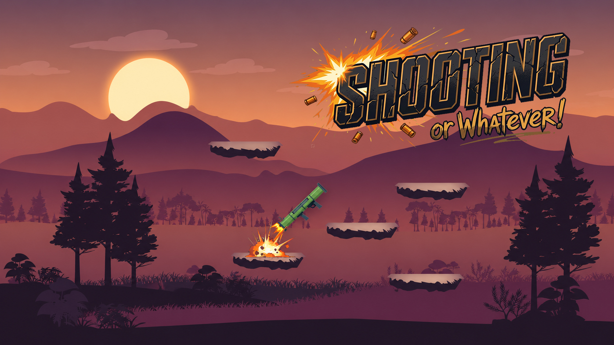

# Shahroz Shahzad

### Senior Unity Developer | Multiplayer • Mobile • Gameplay Systems

Building polished, scalable and performance-focused experiences with **Unity & C#**.

**Phone:** +966 56 821 2973

---

## 👨‍💻 About Me

I am a Unity developer focused on **multiplayer games, mobile development, gameplay architecture, UI systems, monetization, backend integrations and optimization**.

I enjoy taking features from **planning and implementation through testing, debugging, optimization and release**. My work spans gameplay mechanics, networking, player systems, UI flows, Firebase, ads/IAP, localization and production-ready mobile builds.

- 🎮 Unity & C# gameplay programming
- 🌐 Multiplayer systems with Photon Fusion, Photon PUN and FishNet
- 📱 Android, iOS, PC and WebGL development
- ⚙️ Reusable architecture, ScriptableObjects, pooling and scalable systems
- 🔥 Firebase, authentication and persistence
- 💰 AdMob, Unity Ads and In-App Purchases
- 🧠 Profiling, debugging and performance optimization
- 🌍 Localization and multilingual UI

---

## 🛠️ Tech Stack

### Core

### Multiplayer & Online

### Mobile & Services

### Unity Tools & Systems
`URP` • `UGUI` • `UI Toolkit` • `TextMeshPro` • `DOTween` • `Cinemachine` • `Addressables` • `ScriptableObjects` • `Object Pooling` • `Localization` • `VContainer`

---

## 🚀 Project Gallery

<table>
<tr>
<td width="50%" valign="top">

### 🤖 Kiosk AI Assistant

Smart interactive assistant experience for kiosk-style deployment with multilingual UX and polished presentation.

**Unity • AI Integration • Arabic/English • Interactive UI**

</td>
<td width="50%" valign="top">

### 🃏 Hunter’s Bar

Four-player multiplayer card game featuring lobby/ready flow, role-based gameplay and mobile deployment.

**Unity • C# • Multiplayer • Mobile • Networking**

</td>
</tr>
<tr>
<td width="50%" valign="top">

### ✈️ Cluster²

Stylized interactive game project with custom presentation, localized visuals and themed environments.

**Unity • UI/UX • Localization • Presentation**

</td>
<td width="50%" valign="top">

### 🔥 Never Trust the Rules

Mobile arcade-style game project focused on quick gameplay, strong visual identity and responsive interaction.

**Unity • Mobile • Arcade Systems • Game Feel**

</td>
</tr>
<tr>
<td width="50%" valign="top">

### 🎯 Shooting or Whatever!

Stylized shooting/platforming project built around responsive shooting mechanics and arcade-style level interaction.

**Unity • 2D Gameplay • Shooting • Level Systems**

</td>
<td width="50%" valign="top">

### 🃏 Hunter’s Bar — Gameplay

In-game multiplayer card-table experience showcasing player interaction, cards and roulette-style mechanics.

**Gameplay Systems • Multiplayer • UI • Mobile**

</td>
</tr>
</table>

> Some commercial and client projects are private. Source code and confidential project details are intentionally not published.

---

## 🎯 What I Can Build

- Multiplayer lobbies, matchmaking and synchronized gameplay
- Player controllers, combat, weapons and abilities
- Inventory, shops, quests and progression systems
- Mobile UI, settings, onboarding and complete game flow
- Firebase authentication and persistent player data
- Ads, rewarded ads, interstitials and IAP
- Localization and Arabic/English interfaces
- Performance optimization and complex Unity bug fixing
- Android/iOS release preparation

---

## 📊 GitHub Activity

---

## 📬 Contact

- **LinkedIn:** [Shahroz Shahzad](http://linkedin.com/in/shah-roz-shahzad-44a812434)
- **Email:** [shahrozbutt1@gmail.com](mailto:shahrozbutt1@gmail.com)
- **Phone:** +966 56 821 2973

If you are looking for a Unity developer for **multiplayer, mobile games, gameplay systems, optimization or full feature implementation**, feel free to get in touch.

---

### Shahroz Shahzad
**Unity Developer • Multiplayer • Mobile Games • Gameplay Systems**

